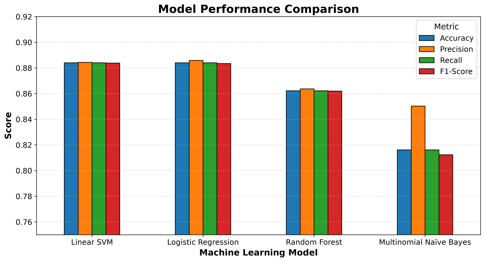
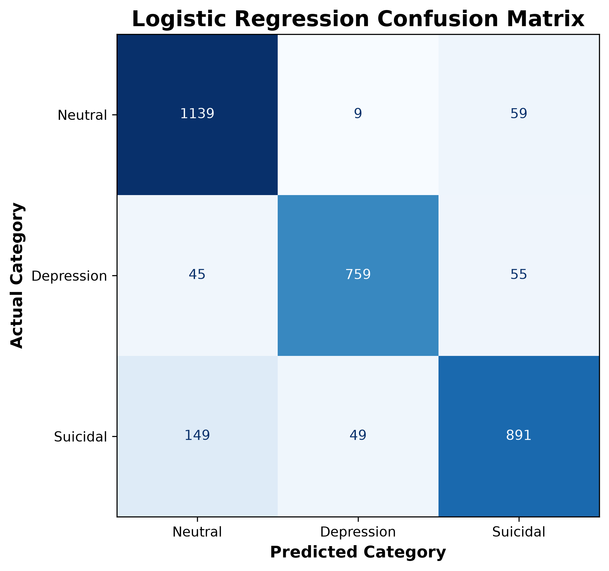

# Mental Health Text Classification Using Natural Language Processing

Graduate Capstone Project (M.S. Data Analytics)

[](#)
[](./LICENSE)

> Capstone project for the Master of Science in Data Analytics at Northwest Missouri State University.

## Project Overview

This capstone project applies Natural Language Processing (NLP) and supervised machine learning techniques to classify social media text into one of three categories:

- Neutral
- Depression
- Suicidal Tendencies

The project evaluates multiple supervised machine learning models to determine how effectively text can be categorized based on linguistic patterns. The goal is to demonstrate how data analytics and NLP can support mental health research while recognizing that machine learning should supplement—not replace—professional clinical evaluation.

## Dataset

The project uses the Suicide Sentiment Analysis Dataset available through Kaggle.

The original dataset contains three CSV files representing:

- Neutral
- Depression
- Suicidal Tendencies

The datasets are merged into a single processed dataset prior to analysis. The merged dataset contains two primary attributes:

- `TEXT` – Social media text
- `Label`
  - 0 = Neutral
  - 1 = Depression
  - 2 = Suicidal Tendencies

Source:
<https://www.kaggle.com/datasets/umar1103/suicide-sentiment-analysis-dataset>

The CSV files required the latin1 encoding during import due to character encoding differences in the original dataset. No additional data extraction was required because the publicly available dataset was already provided in CSV format suitable for analysis.

## Project Structure

```text
capstone-nlp-mental-health/
│
├── data/
│   ├── processed/
│   ├── raw/
│
├── docs/
│   └── index.md
│   └── project-instructions.md
│   ├── glossary.md
│   ├── methodology.md
│   ├── results.md
│   └── figures/
│
├── models/
│   └── best_model.joblib
│   └── tfidf_vectorizer.joblib
│
├── notebooks/
│   ├── 01_data_preparation.ipynb
│   ├── 02_text_preprocessing.ipynb
│   ├── 03_exploratory_data_analysis.ipynb
│   ├── 04_feature_engineering.ipynb
│   └── 05_predictive_modeling.ipynb
│   └── 06_interpretation_of_results.ipynb
│
├── src/
│
└── README.md
```

## Technologies

- Python
- Jupyter Notebooks
- pandas
- NumPy
- matplotlib
- scikit-learn
- spaCy
- NLTK
- ftfy
- Git
- GitHub

## Reproducibility

This project follows a fully reproducible workflow using Python, uv, Git, and GitHub. All preprocessing, feature engineering, predictive modeling, and interpretation steps are documented through Jupyter notebooks, project documentation, and the accompanying capstone report.

## Project Workflow

1. Data Validation and Cleaning
2. Text Preprocessing
3. Exploratory Data Analysis (EDA)
4. TF-IDF Feature Engineering
5. Predictive Modeling
6. Interpretation of Results

## Repository Contents

- data/raw/ – Original Kaggle datasets
- data/processed/ – Processed datasets
- notebooks/ – Jupyter notebooks
- models/ – Saved machine learning artifacts
- src/ – Python source code
- docs/ – Supporting documentation

## Project Progress

- [x] Repository created
- [x] Development environment configured
- [x] Dataset selected
- [x] Merge datasets
- [x] Data validation
- [x] Text preprocessing
- [x] Exploratory Data Analysis (EDA)
- [x] Feature engineering
- [x] Predictive Modeling
- [x] Interpretation of Results
- [x] Final Report

## Data Preparation

The original Kaggle dataset consisted of three separate CSV files representing the three classification categories:

- Neutral
- Depression
- Suicidal Tendencies

The datasets were imported into Python using pandas and validated prior to merging. The following data preparation steps were completed:

- Loaded all three CSV datasets into separate pandas DataFrames.
- Resolved a character encoding issue by importing the files using the `latin1` encoding.
- Validated dataset dimensions, column names, and data types.
- Removed an unnecessary `Unnamed: 2` column from the Depression dataset that resulted from the original file export.
- Filled missing label values in the Neutral dataset with the appropriate class label (0).
- Removed records containing missing text values because they cannot be used for NLP classification.
- Merged the three datasets into a single dataset.
- Verified the final class distribution after cleaning.
- Saved the cleaned dataset to `data/processed/mental_health_text_dataset.csv`.

### Data Quality Observations

During validation, a small number of records contained character encoding artifacts (for example, malformed characters such as `Ã`). Most affected records remained readable and will be addressed during the text preprocessing phase. Severely corrupted or non-English records will be evaluated for removal if they do not contribute meaningful information to the English-language classification models.

The final cleaned dataset contains:

- **17,699 records**
- **2 attributes**
  - `Label` (target variable)
  - `TEXT` (social media text)

# Data Cleaning and Preprocessing

## Data Validation and Cleaning

The original dataset consisted of three CSV files representing the **Neutral**, **Depression**, and **Suicidal Tendencies** classes. Each dataset was inspected to validate its structure, including:

- Column names
- Data types
- Record counts
- Missing values
- Duplicate records

Data cleaning included:

- Removed the unnecessary `Unnamed: 2` column from the Depression dataset.
- Imported the datasets using the `latin1` encoding to address character encoding inconsistencies.
- Assigned missing labels in the Neutral dataset to the Neutral class (`0`).
- Removed records containing missing text values.
- Merged the three datasets into a single cleaned dataset.
- Exported the cleaned dataset for preprocessing.

**Cleaned dataset size:** **17,699 records**

---

## Text Preprocessing

The cleaned dataset underwent several preprocessing steps to prepare the text for Natural Language Processing (NLP) and machine learning.

Preprocessing included:

- Removed conflicting duplicate records with inconsistent class labels.
- Removed duplicate records with identical text and labels.
- Repaired character encoding artifacts using the **ftfy** Python library.
- Removed HTML tags, URLs, email addresses, user mentions, and common social media editorial markers.
- Converted text to lowercase.
- Replaced numeric values with a common `number` token.
- Removed punctuation.
- Standardized whitespace.
- Tokenized and lemmatized text using the **spaCy** Python library.
- Removed stop words while preserving important negation terms such as *no*, *not*, and *never*.
- Removed records containing no meaningful processed text.

The final processed dataset contains **15,774 records** and serves as the input for exploratory data analysis, feature engineering, and machine learning model development.

## Exploratory Data Analysis (EDA)

Exploratory Data Analysis (EDA) was performed to better understand the structure and characteristics of the preprocessed dataset before feature engineering and model development.

The analysis included:

- Dataset validation
- Class distribution analysis
- Text length statistics and boxplots
- Word frequency analysis
- Bigram analysis
- Qualitative word cloud visualization

### Key Findings

- Logistic Regression achieved **88.40%** overall classification accuracy.
- Logistic Regression and Linear SVM were the highest-performing models.
- The primary classification challenge involved distinguishing some Suicidal posts from Neutral posts.
- TF-IDF feature engineering effectively captured meaningful language patterns across all three mental health categories.

---

## Feature Engineering

The cleaned and preprocessed text was transformed into numerical features using Term Frequency–Inverse Document Frequency (TF-IDF). This technique converts text into sparse numerical vectors that reflect the relative importance of words within each document while reducing the influence of commonly occurring terms.

Feature engineering included:

- Splitting the dataset into training (80%) and testing (20%) subsets using stratified sampling
- Applying TF-IDF vectorization to the preprocessed text
- Learning the vocabulary from the training data only to prevent data leakage
- Transforming both training and testing datasets into sparse feature matrices
- Inspecting the resulting sparse feature matrices and learned vocabulary
- Saving the fitted TF-IDF vectorizer for reuse during predictive modeling

## Predictive Modeling

The final phase of the project developed and evaluated supervised machine learning models for classifying mental health-related social media posts. Text was transformed into numerical features using a previously trained TF-IDF vectorizer, and multiple classification algorithms were evaluated using an 80/20 stratified train-test split.

Models evaluated included:

- Logistic Regression
- Multinomial Naïve Bayes
- Linear Support Vector Machine (Linear SVM)
- Random Forest

Model performance was evaluated using:

- Accuracy
- Weighted Precision
- Weighted Recall
- Weighted F1-Score

Logistic Regression and Linear SVM achieved the highest overall classification accuracy (88.40%). Although Linear SVM achieved a slightly higher weighted F1-score, Logistic Regression achieved the highest weighted precision while matching the highest overall accuracy. Based on these evaluation metrics, its interpretability, and its ability to generate probability estimates, Logistic Regression was selected as the final predictive model.

## Model Performance

| Model                   | Accuracy | Precision | Recall | F1-Score |
| ----------------------- | -------: | --------: | -----: | -------: |
| Linear SVM              |   0.8840 |    0.8843 | 0.8840 |   0.8838 |
| Logistic Regression     |   0.8840 |    0.8858 | 0.8840 |   0.8834 |
| Random Forest           |   0.8621 |    0.8636 | 0.8621 |   0.8620 |
| Multinomial Naïve Bayes |   0.8162 |    0.8503 | 0.8162 |   0.8123 |

### Model Performance Comparison



### Confusion Matrix



## Interpretation of Results

The final Logistic Regression model was evaluated using overall classification metrics and a confusion matrix. Model performance was compared across four supervised machine learning algorithms using accuracy, weighted precision, weighted recall, and weighted F1-score.

The confusion matrix demonstrated that most posts were classified correctly, while also identifying that the largest number of classification errors occurred when Suicidal posts were predicted as Neutral. These results indicate that distinguishing some suicidal language from neutral language remains the most challenging aspect of the classification task. Based on the overall evaluation metrics, interpretability, and probability estimates, Logistic Regression was selected as the final predictive model.

## Key Findings

Logistic Regression achieved 88.40% overall classification accuracy.
Logistic Regression and Linear SVM were the highest-performing models.
The primary classification challenge involved distinguishing some Suicidal posts from Neutral posts.
TF-IDF feature engineering effectively captured language patterns across the three mental health categories.

## Final Capstone Report

The complete graduate capstone report is available here:

📄 [Mental Health Text Classification Using Natural Language Processing (PDF)](report/Sowers_Capstone_Report.pdf)

## Project Documentation

Additional project documentation is available through GitHub Pages.

📘 https://ssowers2.github.io/capstone-nlp-mental-health/

## Project Highlights

- Compared four supervised machine learning algorithms
- Selected Logistic Regression as the final predictive model based on evaluation metrics
- Interpreted model performance using a confusion matrix and classification metrics
- Natural Language Processing (NLP)
- TF-IDF Feature Engineering
- Supervised Machine Learning
- Logistic Regression
- Linear Support Vector Machine
- Random Forest
- Multinomial Naïve Bayes
- Jupyter Notebooks
- Python
- MkDocs Documentation
- GitHub Pages

## Development Guide

### Initial Setup (One-Time)

```shell
# Updates the uv tool itself
uv self update

# Pins the project to Python 3.14 by creating/updating the .python-version file.
# If Python 3.14 isn't installed, uv can install it.
uv python pin 3.14

# It creates the .venv virtual environment (if it doesn't already exist).
# Installs all project dependencies from pyproject.toml.
# Installs the development and documentation dependencies.
# Updates packages if newer compatible versions are available.
uv sync --extra dev --extra docs --upgrade

uvx pre-commit install
uvx pre-commit run --all-files
```

### Daily Workflow

1. Open VS Code.
2. Open the project folder.
3. Open a terminal.
4. Pull the latest changes (if applicable):

```shell
git pull
```

5. Open the notebook or Python file.
6. Select the `.venv` kernel in Jupyter.
7. Run your code.
8. Save your work.

### Before Committing

Format and lint your code:

```shell
uv run ruff format .
uv run ruff check . --fix
```

### Commit Changes

```shell
git add -A
git commit -m "Describe your changes"
git push
```

### Running Python Modules

```shell
uv run python -m <module_name>
```

### Running Jupyter Notebooks

- Open the notebook.
- Select the project's `.venv` kernel.
- Click **Run All**.

### Updating Dependencies

```shell
uv sync
```

## Git Troubleshooting

### Accidentally Pushed to the Wrong GitHub Repository

If you clone an existing project to use as a template, Git will continue pointing to the original GitHub repository until the remote is changed.

#### Check the current remote

```shell
git remote -v
```

Example:

```text
origin  https://github.com/ssowers2/capstone-nlp-mental-health.git (fetch)
origin  https://github.com/ssowers2/capstone-nlp-mental-health.git (push)
```

#### Change the remote to a new GitHub repository

```shell
git remote set-url origin https://github.com/ssowers2/capstone-nlp-mental-health.git
git remote -v
git push -u origin main
```

### Restore an Existing Repository

If changes were accidentally pushed to the wrong GitHub repository, restore it from a clean local copy.

Verify you are in the correct local project folder:

```shell
git remote -v
git status
```

If everything looks correct, overwrite the GitHub repository with your local version:

```shell
git push --force
```

**Only use `--force` when you intentionally want your local repository to replace the GitHub version.**

### Large Dataset Won't Commit

If Git blocks large raw datasets, keep them locally and ignore them.

Add to `.gitignore`:

```text
data/raw/
```

Remove the files from Git tracking (they remain on your computer):

```shell
git rm --cached data/raw/Neutral.csv
git rm --cached data/raw/Depression.csv
git rm --cached data/raw/Suicadal_tendencies_data.csv
```

Then commit normally.

### Useful Git Commands

Check repository status:

```shell
git status
```

Check commit history:

```shell
git log --oneline
```

Check the connected GitHub repository:

```shell
git remote -v
```
